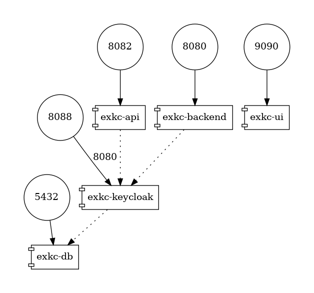

# Examples Keycloak (exkc)

## introduction

This project shows:
* how to use an authentication and authorization service like Keycloak
to manage a user directory service
* how to connect to the user directory from a *spring boot* app and a web UI,
 and which are the related concepts

## Keycloak concepts

### objects

the following Keycloak objects are covered:

* [realm](exkc-keycloak/realm/exkc.json)
* users
* roles to be defined on a realm
* assigning a user one or more realm roles
* OAuth2.0 client of type *public*, typically to be embedded in a web UI in a browser
* OAuth2.0 client of type *confidential*, typically to be embedded in an application that can store secrets,
because this client authenticates through a *client id* and a *client secret*, provided by the user directory
* JWT, *token* signed by the user directory, containing *claims*, which are data about the user and permissions
* signature verification of the JWT token, through the Keycloak certificate 
 (downloaded by spring boot and stored in a cache for 5 minutes by default https://docs.spring.io/spring-security/reference/servlet/oauth2/resource-server/jwt.html#oauth2resourceserver-jwt-timeouts )

### roles

the following concepts of roles are covered:

* manage users with roles in Keycloak 
* position roles in JWT tokens through a custom *token mapper*
* express roles in an application spring boot to secure web methods (ex through le tag *hasRole*)
* configure and customize in spring security the read of *token claims* and use them in the application logic

### *grant types* OAuth2.0

the following concepts are covered:
* *authorization code flow* with *PKCE*, used in a web UI
* *client credentials flow*, imposing the client authentication through a *client id* and *client secret*, 
  used in an backend storing a secret in a secure way
* *password* (deprecated but useful to test and debug)

### operations on token
* [get](exkc-ui/public/auth.js#L13) a token
* [refresh](exkc-ui/public/auth.js#L34) a token
* [logout](exkc-ui/public/auth.js#L54) (delete of a token through deletion of local storage items and Keycloak cookies in the browser)

### Keycloak admin api
see the [java file](exkc-backend/src/main/java/exkc/shared/api/keycloak/service/KeycloakClientService.java)

## schema of docker containers



## build

```bash
cd exkc-api
mvn package
cd ..
podman-compose build exkc-api
```

```bash
cd exkc-backend
mvn package
cd ..
podman-compose build exkc-backend
```

```bash
podman-compose build exkc-ui
```

```bash
podman-compose build exkc-keycloak
```

## run

```bash
podman-compose up
podman-compose down
```

## access

[http://localhost:9090](UI)

[http://localhost:8088](Keycloak) admin/admin

## how to delete data

podman volume rm presentationkeycloak_pgdata

